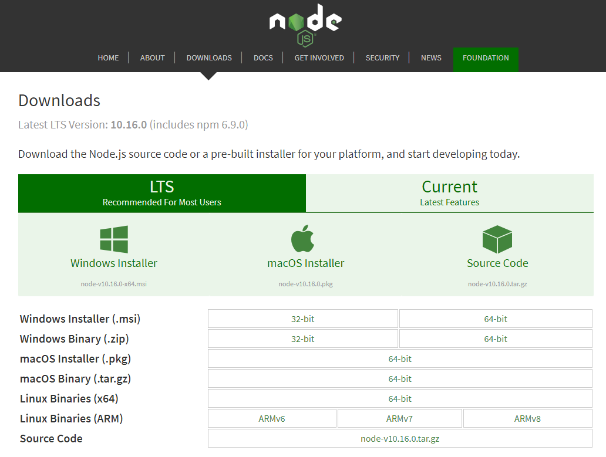
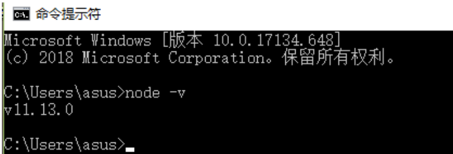
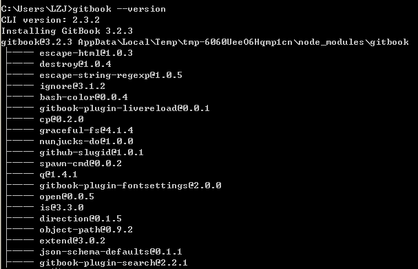

# 安装

## window下安装

**1.安装Node.js **

+ node.js下载
官方下载地址为：https://nodejs.org/en/download/

+ 安装node.js
+ 查看安装是否成功
打开命令提示符/cmd，输入```node -v```检查是否安装成功


**2. 利用npm安装gitbook **
利用npm安装gitbook-cli

```
npm install -g gitbook-cli
```

其中```gitbook-cli```是gitbook的一个命令行工具，通过它可以在电脑上安装和管理多个gitbook的多个版本。

**gitbook-cli和gitbook**

+ gitbook 和gitbook-cli是两个软件；
+ gitbook-cli会将下载的gitbook的不同版本放到~/.gitbook中，可以通过`GITBOOK_DIR`环境变量来指定另外的文件夹。

**3.gitbook版本查看**

```
gitbook --version
```
在进行版本查看的时候，他会自动安装一些东西，等一段时间才会出现版本号
