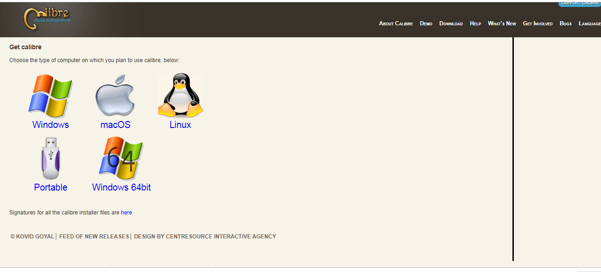

# 书籍打包

## 前期准备

**1.安装依赖**

本地安装```calibre```软件。该软件官网为<https://calibre-ebook.com/>



**2.查看是否安装成功**

```
ebook-convert --version
```


**2.利用gitbook生成进行打包**

```
gitbook pdf .  //pdf
gitbook epub .  //epub电子书
gitbook mobi . //mobi电子书
```

**3.注意事项**

+ 安装```calibre```后，有时需要重启一下才能生效。